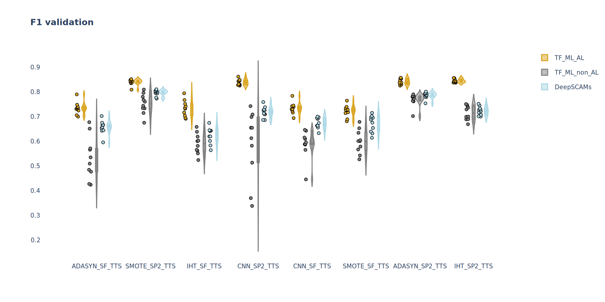
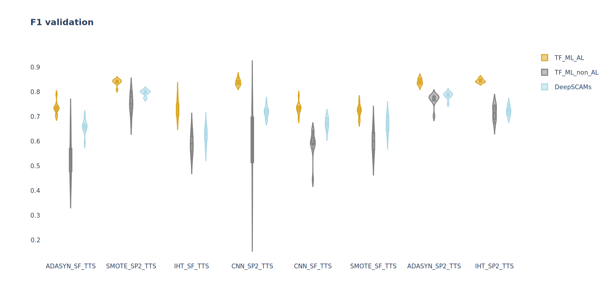
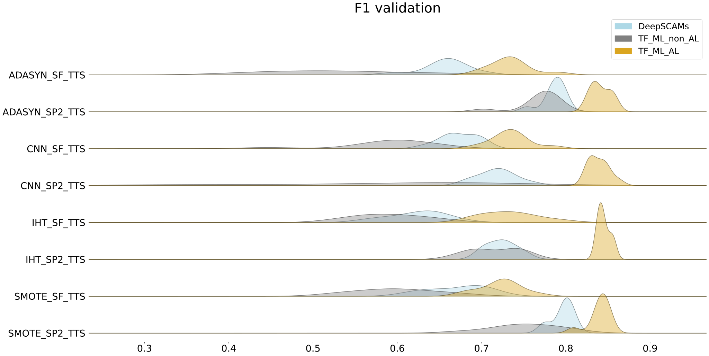

# [Some name] a class to compare performance of AL and non-AL models

Example of command to run the pipeline:

```$  python main.py -s_n 'N_SF_TTS'```

I used [t-test for means of two independent samples](https://docs.scipy.org/doc/scipy/reference/generated/scipy.stats.ttest_ind_from_stats.html), since our AL and non-AL models are trained on different data 
(AL training set is a subset of non-AL training set). 

# UML


# Research Summary

**hypothesis** *Training data sampling can significantly improve the performance of SCAM classification models*

**measure of success** We define a data sampling strategy to improve the performance if a machine learning model that includes the sampling strategy has a significantly better performance compared to the same machine learning model but without the sampling strategy. To evaluate such pairs of models, we will
- keep all other model parameters and pre-processing steps consistent (e.g. dataset, train-test split, parameter optimization strategy, used descriptors, feature selection strategy) 
- performance metric: ROC AUC, MCC, F1
- test set: 60-30% training-test split of original data, while ensuring consistent imbalance in test set (stratified) and using scaffold-based group assignment.
- we will repeat training-test split 10-times and use bonferroni corrected t-test p values to ensure differences are significant.

To ensure that our hypothesis is generalizable and not limited to a single use case, we will explore these different scenarios
- sampling strategies
  - ADASYN
  - SMOTE
  - CondensedNearestNeighbor
  - ActiveLearning
- dataset
   - small Shoichet dataset from Excel sheet
   - larger Shoichet dataset Excel + large set of positive data from AggAdvisor
   - dataset from Tropsha SCAMDetective based PubChem
     - bLactamase https://pubs-acs-org.proxy.lib.duke.edu/doi/suppl/10.1021/acs.jcim.0c00415/suppl_file/ci0c00415_si_002.zip
     - Cruzain https://pubs-acs-org.proxy.lib.duke.edu/doi/suppl/10.1021/acs.jcim.0c00415/suppl_file/ci0c00415_si_003.zip
- descriptor
  - ECFP (Morgan)
  - RDKit Fingerprint
- feature processing
  - none
  - feature scaling
- models
  - TF MLP
  - DeepSCAMs


# Results
Results could be found [here](Description/Update.pdf)


# Folder names

| Sampling           | Dataset  | Split |
|:-------------:| -----:|-----:|
| N (No sampling) | SF (SCAMS_filtered.csv) | TTS (train_test_split) | 
| SMOTE    |   SP1 (SCAMS_balanced_with_positive.csv) | B (split_with_butina) |
| ADASYN  |    SP2 (SCAMS_added_positives_653_1043.csv) | SS (split_with_scaffold_splitter) |
| CondensedNearestNeighbour (CNN)     |    __ | __ |
| InstanceHardnessThreshold (IHT)    |    __ | __ |

For example, N_SF_SS stands for run with with no sampling on SCAMS_filtered.csv and scaffold_splitter


# Other approaches
## SCAMs detective (SD)
There are two models presented with SD (**cruzain** and **beta-lactamase**). I made a mistake in the previous email and wrote that there were 4 models, as pbz2-files were not models.


## Results
I trained in parallel  DC and our models, and visualized the results.

#### Study 1

- **Results on the test set**
 

- **Results on the validation set**
 

#### Study 2
- **Results on the test set**

  
- **Results on the validation set**
 


## Visualization

[Here](Results/Study_1/Prepape_figures.ipynb) is an example of a notebook I wrote to visualise the results. 

Conceptually, there are tree variant:
- **Violin plot + Scatter plot**
 
  
- **Violin plot**
 
  
- **Ridgeline plot** (I assume it is the most informative)
 


[comment]: <> (# DeepSCAMs validation set ∩ with the training datasets)

[comment]: <> (- I [checked]&#40;/SCAMs/intersection_DeepSCAMs_ds_cruzian.py&#41; the similarity of compounds in the DeepSCAMs validation set &#40;DLS&#41; with the cruzain dataset &#40;used morgan fingerprints&#41;. Here is [the table]&#40;/Similarity/DLS_cruzian.csv&#41;. 17/65 compounds from the DLS dataset have one or more compounds in the cruzain dataset with Tanimoto coefficient &#40;TC&#41; > 0.7.)

[comment]: <> (- Checked the similarity of compounds in the DLS dataset with the beta-lactamase dataset, found 18/65 highly similar compounds. [The resulting table is here]&#40;/Similarity/DLS_beta_lactamase.csv&#41;. Albeit, the performance of the model trained on the beta-lactamase dataset was lower.)

[comment]: <> (- Checked the similarity of compounds in the DLS dataset with the SF dataset, found 2/65 compound with the same TC threshold. [The resulting table is here]&#40;/Similarity/DLS_SCAMS_filtered.csv&#41;.)

[comment]: <> (- Checked SCAMS_added_positives_653_1043.csv vs. DLS. Found 4/64 with the same TC threshold.  [The resulting table is here]&#40;/Similarity/DLS_added_positives_653_1043.csv&#41;)

[comment]: <> (- Checked SCAMS_balanced_with_positive.csv vs. DLS. Found 2/64 with the same TC threshold.  [The resulting table is here]&#40;/Similarity/DLS_SCAMS_balanced_positive.csv&#41;)


